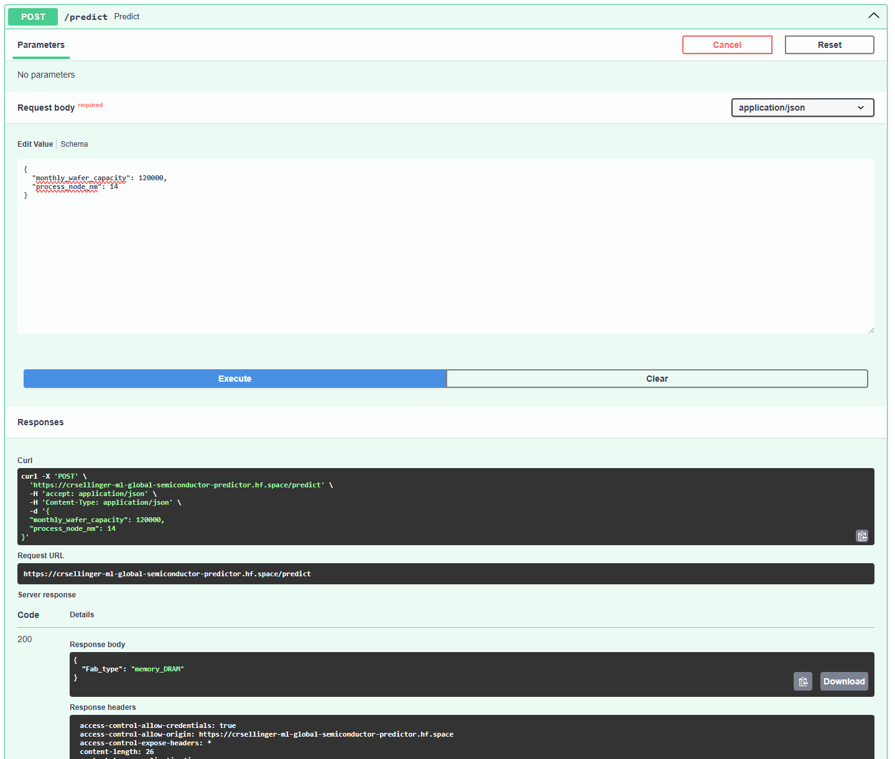
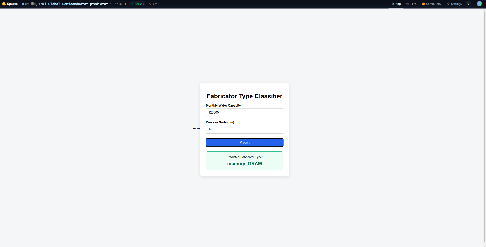
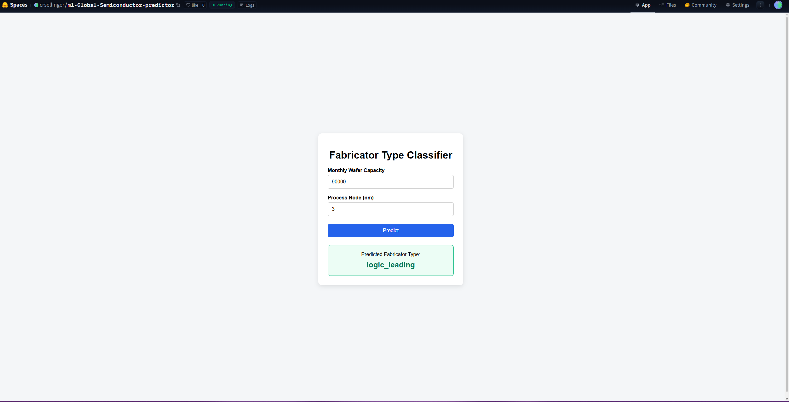

# Project Documentation

This site provides project documentation.
Use the documentation navigation to explore.

## How-To Guide

Many instructions are common to all our projects.

See
[⭐ **Workflow: Apply Example**](https://denisecase.github.io/pro-analytics-02/workflow-b-apply-example-project/)
to get the example projects running on your machine.

## Project Documentation Pages (docs/)

- **Home** - this documentation landing page
- [**Project Instructions**](./project-instructions.md)  - the standard project workflow
- [**Your Files**](./your-files.md) - how to copy the example and create your version
- [**Glossary**](./glossary.md) - project terms and concepts
- [**API**](./api.md) - autogenerated code documentation for the public project interface

## Serving a Model (Hosting an Endpoint)

- [**Online Predictions**](./api-predict.md)

## Deployment Options

- [**HuggingFace**](./huggingface.md) - free, no CC required
- [**Render**](./render.md) - free, easier, CC required

## Phase 4. Technical Modification

Describe your small technical modification to the example project.

Include:

- What you changed: Added my Kaggle dataset, instead of using penguins. Created my serve, model builder, and notebook code with appropriate changes to feature cols, target columns, necessary imports, and new model path. Updated load_data to clean my new dataset, dropping rows with 0 values and using the top 4 fab_types since I some classes were to small to stratify as they only appeared once or twice. Updated Section 5 of notebook with new feature columns and test values.
- Why you chose that change: To get my custom project started.
- How you verified that it worked: ran model builder, then serve, then ran notebook and verified output, no errors.
- What result, output, chart, metric, or behavior confirmed the change: New dataset loaded correctly, trained new model artifact csellinger_model.joblib, and tested the serve core, which resulted in appropriate prediction and expected bad_payload output.

Compared with the example project,
explain what is different and why the change matters.

Was it easy, or surprisingly challenging and why do you think so?

Mostly easy, just had to be meticulous with all the code changes and where everything lived. Hardest part I had was fixing the stratify error as the error came out as followed: "The minimum number of groups for any class cannot be less than 2. Classes with too few members are: ['memory_HBM_packaging']" and I didn't realize the data I was looking at. I decided not to go with a non-stratified split, such as a KFold, and took the top 4 fab_types to get a large enough sample size for each class.

## Phase 5. Custom Project

Describe your custom project and how you made your modeling decisions.

Be specific about what changed from the example project.

### Basis and Data

Describe the dataset, input, or example you started with.

Include:

- The original example dataset or input: Global Semiconductor Industry 2010-2026
- The data source: KaggleHub
- Why you chose it, kept it, or changed it: Simple classification prediction served through Hugging Face
- Any important limitations or assumptions:

### Example Model and Serving Approach

Describe the model being served and how it is deployed.

Include:

- What the model predicts and what inputs it expects: predicts fab_type based on monthly_wafer_capacity and process_node_nm
- How the model was trained and saved: loaded into pandas dataframe, trained on stratified test and train sets with Random Forest, saved with piplined joblib dump file, all in model_builder_csellinger.py
- How the API receives a request and returns a prediction: Accepts POST request with JSON format of monthly_wafer_capacity and process_node_nm.

Example:

```json
{
  "monthly_wafer_capacity": 9000,
  "process_node_nm": 20
}
```

- Where the model is deployed (local, Render, Hugging Face, or other): Hugging Face. But, can be run locally with appropriate dependencies installed.

### Custom Application

Describe your custom dataset, model, or API changes.

Include:

- What you changed from the example (dataset, model, endpoint, or inputs):

  Added my Kaggle dataset, instead of using penguins. Created my serve, model builder, and notebook code with appropriate changes to feature cols, target columns, necessary imports, and new model path. Updated load_data to clean my new dataset, dropping rows with 0 values and using the top 4 fab_types since I some classes were to small to stratify as they only appeared once or twice. Updated Section 5 of notebook with new feature columns and test values.

- Why you made those changes:

  Wanted to get Hugging Face implementation running so others could use it, so a simple classification predictor sufficed.

  **Note: Predictor mostly relies on process_node_nm, not monthly_wafer_capacity, if anyone wants to try it out. Training dataset can be found [HERE](https://www.kaggle.com/datasets/sergionefedov/global-semiconductor-industry-2010-2026/data?select=fab_capacity.csv)

- How you verified that your custom model or API works correctly: Followed docs link [HERE](https://crsellinger-ml-global-semiconductor-predictor.hf.space/docs) -> click POST/predict section -> Try it out -> Type your prediction values -> Execute

  You should see the prediction in the Responses section.

### Summary

Summarize your custom project.

Include:

- How you implemented your custom model or API: Using FastAPI, loaded the model artifact, made a request class, and a predict function that uses the request class for the JSON input, and a prediction function using random forest
- What results you got: A prediction output of one of four top classes in fab_type.
- What you learned: How to implement a Hugging Face interface for my machine learning prediction that everyone can use.
- How well you exercised the skills covered in this project: I think pretty well. There's still a lot I can do but I now know how to process a pipeline to build and serve a machine learning model.
- What kinds of real problems you could apply these skills to in the future: This would be a great use for my non-profit organization to predict outcomes for new campaigns. Different development officers can use something like this to see possible outcomes for new campaigns or estimate donations for fund events.

Links for my Hugging Face web interface are in the huggingface.md file, but for convenience they are listed here if you wanted to test:

[Predictor App](https://huggingface.co/spaces/crsellinger/ml-Global-Semiconductor-predictor)

[Repo Files](https://huggingface.co/spaces/crsellinger/ml-Global-Semiconductor-predictor/tree/main)

[FastAPI Doc Test Area](https://crsellinger-ml-global-semiconductor-predictor.hf.space/docs)

Display at least one image or screenshot showing your work.






